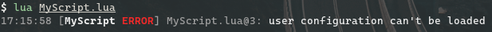

¡Lee la versión en español [aquí](README_es.md)!

# Logger (Work In Progress)

Logger is a small log utility library for Lua that allows you to write logs to files and/or the console.
Logger is very simple, here goes an example:

```lua
local Logger = require("Logger")
local log = Logger("MyScript", os.getenv("HOME"), true)

-- BLABLABLA CODE CODE CODE

local userConf = load_user_config() -- EXAMPLE
log:log(userConf, "error", "user configuration can't be loaded")

-- HERE GOES EVEN MORE CODE
```

You will get an output like this:



And a file in your `$HOME` named `MyScript_DATE.log` (where `DATE` is the current system date) that contains something like this:

```
17:15:58 [MyScript ERROR] MyScript.lua@3: user configuration can't be loaded
```

### Dependencies

Before to start reading the docs, you need to know that Logger requires 2 libraries (for now):

  1. [Self][SelfRepo] For the OOP handling
  2. [TermColors][TCRepo] For the colored text

### Documentation

Logger only provides 2 functions/methods:

  * `new([name, dir, console])`: Constructor. Same as `Logger()`. This function is only for a more comfortable use and the purpose is to basically just prepare a few elements for the `log()` function.
    Arguments:
    * (__string__) `name` The name of your app/script/project/etc. Basically a namespace, useful if you want to use various Logger instances.
    * (__string__) `dir` An existing directory where Logger saves log files. If `dir` doesn't exists, it will throw an error.
    * (__boolean__) `console` Set to `true` if you want logs into the console (`stdout`) too. `false` by default, Logger only writes log *FILES*.

  * `log(exp, lvl, msg, ...)`: Well... Writes logs!...
    Arguments:
    * (__any__) `exp` if this argument is `nil` or `false`, then Logger will write the log message and if the log level is 5, 6 or 7, Logger stops the script.
    * (__number__ or __string__) `lvl` The log level of importance (see the table below).
    * (__string__) `msg` The log message. Also supports the [TermColors][TCRepo] markup.
    * (__any__) `...` Varargs, used with `string.format()` for push values in `msg`.

The `log()` function accepts the following values in the `lvl` (AKA "level of importance") argument:

| Number\* | String\*\* |
| :----- | :----- |
| `1` | `"trace"` |
| `2` | `"debug"` |
| `3` | `"info"`  |
| `4` | `"warn"`  |
| `5` | `"error"` |
| `6` | `"fatal"` |
| `7` | `"other"` |

__\*__: the preferred number value.

__\*\*__: the allowed string equivalent value.

For numbers in the `log()` function, if it is a diferent of one in the above table, then you will get an error.
For strings, if is diferent of one in the above table, then is ignored and the log is written with level of importance 7.

[SelfRepo]: https://github.com/M1que4s/Self
[TCRepo]: https://github.com/M1que4s/TermColors
