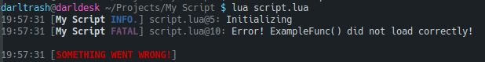

# Logger

Logger is a small utility library for Lua logs that you can easily integrate into your projects.
Here a small example:

```lua
local Logger = require("Logger")
local log = Logger("MyScript", os.getenv("HOME"), true)
log("Log library started!", "info")
log("This is a debug message")

-- A little of code here...

local config = load_config() -- example function...
-- Like assert() function
log:expect(type(config) == "table", "user config can't be loaded")

-- More code here...
```

You will get an output like this:



And a file in your `$HOME` folder called `MyScript_DATE.log` (where `DATE` is the result of `os.date("%Y-%m-%d")`) with content like this:

```
11:43:55 [AUTOGENERATED BY LOGGER]
11:43:55 [MyScript INFO.] Test.lua@3: Log library started!
11:43:55 [MyScript DEBUG] Test.lua@4: This is a debug message
11:43:55 [MyScript ERROR] Test.lua@10: user config can't be loaded

11:43:55 [SOMETHING WENT WRONG!]
```

### Documentation:

Logger provides 6 functions/methods:

   - `new([name, dir, console, suffix, header, ...])`: Constructor. Same as `Logger()`. This function is made for those who like to do it the :new() way and basically prepares some elements to be used by the `log()` function. 
    - (__string [optional]__) `name` The name of your application/project/script/etc. Basically a name that you can identify with something in particular, is useful if you plan to use several instances of Logger on a single proyect.
    - (__string [optional]__) `dir` An existing directory where Logger will store the log files. If it does not exist, Logger will crash.
    - (__boolean [optional]__) `console` By default, Logger only writes log files, but if this argument is `true`, then it will also write logs to the terminal/console.
    - (__string [optional]__) `suffix` You can change the default file suffix, which is: 'Year-Month-Day' in numbers. This argument _NEEDS_ to be a string with a format accepted by `os.date()`.
    - (__string [optional]__) `header` When this function is called to create a logger instance, a header is always written before all the records in the file, which is "AUTOGENERATED BY LOGGER" by default. With this argument you can change that text.
    - (__any [optional]__) `...` Varargs used with `string.format()` for the `header` argument. (`string.format()`)

  - `log(msg [, lvl, ...])`: The main function that writes logs. In a Logger instance it can be called with `log()` instead of `log:log()`. Arguments:
    - (__string__) `msg` The message you want to log.
    - (__string [optional]__) `lvl` The log level (see list below).
    - (__any [optional]__) `...` Varargs used with `string.format()` to place values in `msg`. (`string.format()`)

  - `expect(exp, msg [, lvl, ...])`: The equivalent of `assert()`. If the `exp` argument is `false` or `nil` then the `msg` message is logged. With the exception of `exp`, all other arguments work as in `log()`:
    - (__any__) `exp` A Lua expression.
    - (__string__) `msg` The message you want to log.
    - (__string [optional]__) `lvl` The log level (see list below).
    - (__any [optional]__) `...` Varargs used with `string.format()` to place values in `msg`. (`string.format()`)

  - `header(msg, ...)`: Write a header that can be used in different ways, such as separating records or creating "breakpoints", etc. Arguments:
    - (__string__) `msg` The message you want to log.
    - (__any__) `...` Varargs for `msg`.

  - `setLogLvl(lvl)`: Logger now internally handles a default logging level, if a lvl isnt specified in log(), it will use that one instead. With this function you can change this value safely. Arguments:
    - (__string__) `lvl` The new default log level.

  - `setFileSuffix(fmt)`: Changes the suffix used in the log file names. Note that this means that several log files can be generated and the logs generated by Logger could be written to different files. Arguments:
    - (__string__) `fmt` The new format. As in the Logger constructor, it is expected to be a text supported by `os.date()`.

The function `log()` and `expect()` accept the following values in the `lvl` argument (referring to the "level of importance"):

  * `"other"` Other
  * `"trace"` Used to show internal traces of stuff in your program
  * `"debug"` Used to show internal stuff of your program as a debugging tool
  * `"info"`  Used to give information about something
  * `"warn"`  Used in case of things that could go wrong
  * `"error"` Used for things that got wrong
  * `"fatal"` Used for things that got terribly wrong

These values follow a level from 0 (`"other"`) to 6 (`"fatal"`). 
A value higher than 4 (`"warn"`) causes Logger to stop the execution of Lua.
