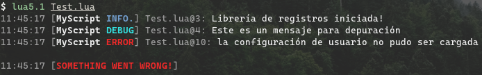

# Logger

Logger es una pequeña librería utilitaria para registros en Lua que puedes integrar facilmente en tus proyectos.
Aquí un pequeño ejemplo:

```lua
local Logger = require("Logger")
local log = Logger("MyScript", os.getenv("HOME"), true)
log("Librería para registros iniciada!", "info")
log("Este es un mensaje para depuración")

-- Algo de código por aquí...

local config = load_config() -- función de ejemplo...
-- Muy similar a la función assert()
log:expect(type(config) == "table", "la configuración de usuario no pudo ser cargada")

-- Más código aquí...
```

Tendrás una salida como esta:



Y un fichero en tu carpeta `$HOME` llamado `MyScript_DATE.log` (donde `DATE` es el resultado de `os.date("%Y-%m-%d")`) con un contenido como este:

```
11:43:55 [AUTOGENERATED BY LOGGER]
11:43:55 [MyScript INFO.] Test.lua@3: Librería de registros iniciada!
11:43:55 [MyScript DEBUG] Test.lua@4: Este es un mensaje para depuración
11:43:55 [MyScript ERROR] Test.lua@10: la configuración de usuario no pudo ser cargada

11:43:55 [SOMETHING WENT WRONG!]
```

### Documentación

Logger provee 6 funciones/métodos:

  * `new([name, dir, console, suffix, header, ...])`: Constructor. Igual que `Logger()`. Esta función es principalmente para un uso más cómodo de la librería y básicamente prepara algunos elementos para ser usados por la función `log()`. Argumentos (opcionales):
    * (__string__) `name` El nombre de tu aplicación/proyecto/script, entre otros. Básicamente un nombre con el que puedas identificar algo en particular, es útil si piensas usar varias instancias de Logger.
    * (__string__) `dir` Un directorio existente donde Logger guardará los ficheros de registro. Si no existe, tendrás un error.
    * (__boolean__) `console` Por defecto, Logger solo escribe ficheros de registro, pero si este argumento es `true`, entonces también escribirá registros en la terminal/consola.
    * (__string__) `suffix` Puedes cambiar el sufijo por defecto de los archivos, el cual es: `Year-Month-Day` en números. Este argumento _debería_ ser un string con el formato aceptado por `os.date()`.
    * (__string__) `header` Cuando esta función es llamada para crear una instancia de Logger, siempre se escribre una cabezera antes de todos los registros en el archivo, la cual es "AUTOGENERATED BY LOGGER". Con este argumento puedes cambiar ese texto.
    * (__any__) `...` Varargs utilizados con `string.format()` para el argumento `header`

  * `log(msg [, lvl, ...])`: La función principal que escribe registros. En una instancia de Logger puede ser llamada con `log()` en lugar de `log:log()`. Argumentos:
    * (__string__) `msg` El mensaje que desea registrar.
    * (__string [opcional]__) `lvl` El nivel de registro (ver la lista más abajo)
    * (__any [opcional]__) `...` Varargs usados con `string.format()` para colocar valores en `msg`.

  * `expect(exp, msg [, lvl, ...])`: El equivalente de `assert()`. Si el argumento `exp` es `false` o `nil` entonces se registra el mensaje `msg`. A excepción de `exp`, todos los demás argumentos funcionan como en `log()`:
    * (__any__) `exp` Una expresión de Lua.
    * (__string__) `msg` El mensaje que desea registrar.
    * (__string [opcional]__) `lvl` El nivel de registro (ver la tabla más abajo)
    * (__any [opcional]__) `...` Varargs usados con `string.format()` para colocar valores en `msg`.

  * `header(msg, ...)`: escribe una cabezera que puede ser usada de diferentes formas, como separar registros o crear "puntos de quiebre", entre otros. Argumentos:
    * (__string__) `msg` El texto que desea registrar.
    * (__any__) `...` Varargs para `msg`.

  * `setLogLvl(lvl)`: Logger ahora maneja internamente un nivel de registro por defecto para que, en caso de no especificarse, ese valor sea usado en su lugar. Con esta función se puede cambiar dicho valor de forma segura.
  Argumentos:
    * (__string__) `lvl` El nuevo nivel de registro por defecto.

  * `setFileSuffix(fmt)`: Cambia el sufijo usado en los nombres de archivo de registro. Ten en cuenta que esto significa que se pueden generar varios archivos de registro y los registros generados por Logger se podrían escribir en diferentes ficheros.
    * (__string__) `fmt` El nuevo formato. Al igual que en el constructor de Logger, se espera que sea un texto soportado por `os.date()`.

La función `log()` y `expect()` aceptan los siguientes valores en el argumento `lvl` (refiriéndose al "nivel de importancia"):

  * `"other"`
  * `"trace"`
  * `"debug"`
  * `"info"`
  * `"warn"`
  * `"error"`
  * `"fatal"`